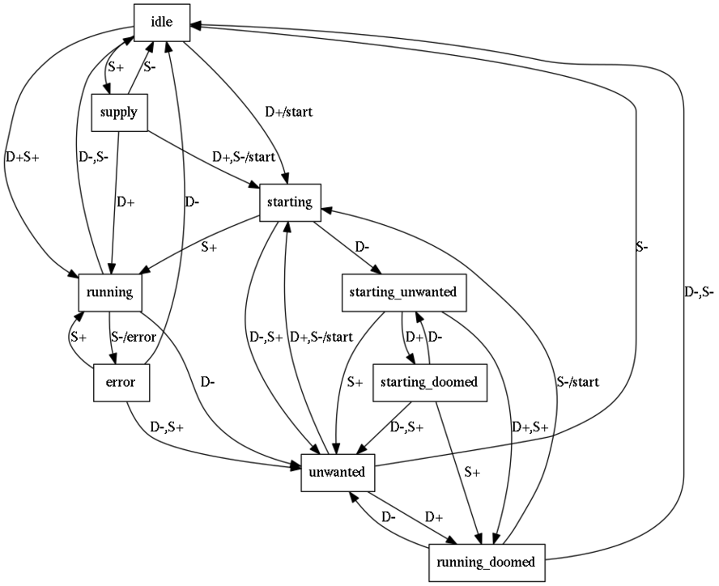

# Demand-matching and Supervision

The Demand Matcher pattern (in `demand-matcher.rkt` and in
`demand-matcher.js`'s `DemandMatcher` class) tracks assertions
representing some abstract *demand* for a resource, and causes the
creation or acquisition of matching *supply* of that resource.

To do this, it tracks the state of each *instance* of the resource.
Each resource instance (called a "task") is uniquely identified by a
projection of the dataspace.

The basic idea is that:

 - When demand for a task is detected, it is started.

 - Each started task signals its presence to the DemandMatcher.

 - When demand drops, the task should detect this and exit.

 - If the task exits unexpectedly, this is an error, and the
   DemandMatcher prints a warning.

## Latency causes problems

However, because there can be some latency between requesting the
start of a task and its signalling its presence to the DemandMatcher,
we can't just figure out what to do based on the presence or absence
of demand and supply for a task. We also need to track a few more bits
of information.

When demand for a task drops briefly, we *expect* a drop in supply,
*even demand increases again before we detect a supply drop*. For this
reason, in some circumstances, the default task supervision strategy
of DemandMatcher *recreates* supply on supply drop in some
circumstances. It keeps track of whether a supply increase is
expected, and of whether a supply decrease is expected for each task.

It becomes an important part of the DemandMatcher protocol for a task
instance to always drop its supply assertion in response to a drop in
demand. This works well in Syndicate implementations that preserve all
assertion transitions, but not at all well where brief transitions may
be elided. In those cases, we will have to reach for a more heuristic
approach involving something akin to Erlang's "Maximum Restart
Intensity" and/or other kinds of time-based decision. For now though,
the precise case works fine.

While it seems simple enough to imagine, the details are rather
fiddly.

## Working out the algorithm that defaultTaskSupervisor should use

We may assume some expected task behaviour: that it will eventually
assert supply, and *then* upon demand drop eventually exit.

    ◇(supply ∧ (¬demand ⇒ ◇ terminate))   (?!?!)

### Complete table of actions

Each row in this table describes actions taken in a particular
circumstance by `defaultTaskSupervisor`.

The table has seven columns:
 - `∃D`, whether demand for the task exists currently
 - `∃S`, whether supply for the task exists currently
 - `ΔD`, whether (and in which direction) demand is changing now
 - `ΔS`, whether (and in which direction) supply is changing now
 - `expS+`, whether we expect a supply increase at some point in future
 - `expS-`, whether we expect a supply decrease at some point in future
 - and an action to take in this circumstance.

The first two values are drawn from the state of the DemandMatcher;
the second two, from the patch event the DemandMatcher is currently
processing; and the third two are private state variables of the task
supervisor itself.

    ∃D ∃S  ΔD ΔS  expS+ expS-  Action
    ---------------------------------------------------------------------------
     -  -   +       -     -    Start task, set expS+
     -  -      +    -     -    No action (but slightly weird)
     -  -   +  +    -     -    No action (but slightly weird)
     -  Y   +       -     -    No action (pre-extant supply)
     -  Y      -    -     -    No action
     -  Y   +  -    -     -    Start task, set expS+
     Y  -   -       -     -    Demand goes after unexpected supply drop
     Y  -      +    -     -    Spontaneous recovery from unexpected supply drop
     Y  -   -  +    -     -    Spontaneous recovery from unexpected supply drop; set expS-
     Y  Y   -       -     -    Set expS-
     Y  Y      -    -     -    Unexpected supply drop error
     Y  Y   -  -    -     -    No action (but slightly weird)

     -  -   +       -     Y    Impossible (expS- would be clear or expS+ set)
     -  -      +    -     Y    Impossible (expS- would be clear or expS+ set)
     -  -   +  +    -     Y    Impossible (expS- would be clear or expS+ set)
     -  Y   +       -     Y    No action
     -  Y      -    -     Y    Clear expS-
     -  Y   +  -    -     Y    Clear expS-, start task, set expS+
     Y  -   -       -     Y    Impossible (expS+ would be set)
     Y  -      +    -     Y    Impossible (expS+ would be set)
     Y  -   -  +    -     Y    Impossible (expS+ would be set)
     Y  Y   -       -     Y    No action
     Y  Y      -    -     Y    Clear expS-, start task, set expS+
     Y  Y   -  -    -     Y    Clear expS-

     -  -   +       Y     -    Impossible (expS+ would be clear or expS- set)
     -  -      +    Y     -    Impossible (expS+ would be clear or expS- set)
     -  -   +  +    Y     -    Impossible (expS+ would be clear or expS- set)
     -  Y   +       Y     -    Impossible (expS+ would be clear)
     -  Y      -    Y     -    Impossible (expS+ would be clear)
     -  Y   +  -    Y     -    Impossible (expS+ would be clear)
     Y  -   -       Y     -    Set expS-
     Y  -      +    Y     -    Clear expS+
     Y  -   -  +    Y     -    Clear expS+, set expS-
     Y  Y   -       Y     -    Impossible (expS+ would be clear)
     Y  Y      -    Y     -    Impossible (expS+ would be clear)
     Y  Y   -  -    Y     -    Impossible (expS+ would be clear)

     -  -   +       Y     Y    No action
     -  -      +    Y     Y    Clear expS+
     -  -   +  +    Y     Y    Clear expS+
     -  Y   +       Y     Y    Impossible (expS+ would be clear)
     -  Y      -    Y     Y    Impossible (expS+ would be clear)
     -  Y   +  -    Y     Y    Impossible (expS+ would be clear)
     Y  -   -       Y     Y    No action
     Y  -      +    Y     Y    Clear expS+
     Y  -   -  +    Y     Y    Clear expS+
     Y  Y   -       Y     Y    Impossible (expS+ would be clear)
     Y  Y      -    Y     Y    Impossible (expS+ would be clear)
     Y  Y   -  -    Y     Y    Impossible (expS+ would be clear)

#### Actions and transitions involving actions

From the table, we learn that the possible actions are:

 - `START`, Start task, set expS+
 - `EXPDROP`, Set expS-
 - `GOTDROP`, Clear expS-
 - `RUNNING`, Clear expS+

There are also a couple of pseudo-actions, `ERROR` for an unexpected
supply drop, and `RECOVER` for circumstances marking spontaneous
recovery after an unexpected supply drop.

The final four columns in this table are the new states of the
DemandMatcher and the task supervisor.

    ∃D ∃S  ΔD ΔS  expS+ expS-  Actions         Next: ∃D ∃S  expS+ expS-
    ---------------------------------------------------------------------------
     -  -   +       -     -    START                  Y  -    Y     -
     -  Y   +  -    -     -    START                  Y  -    Y     -
     Y  -   -       -     -    RECOVERY               -  -    -     -
     Y  -      +    -     -    RECOVER                Y  Y    -     -
     Y  -   -  +    -     -    RECOVER EXPDROP        -  Y    -     Y
     Y  Y   -       -     -    EXPDROP                -  Y    -     Y
     Y  Y      -    -     -    ERROR                  Y  -    -     -

     -  Y      -    -     Y    GOTDROP                -  -    -     -
     -  Y   +  -    -     Y    GOTDROP START          Y  -    Y     -
     Y  Y      -    -     Y    GOTDROP START          Y  -    Y     -
     Y  Y   -  -    -     Y    GOTDROP                -  -    -     -

     Y  -   -       Y     -    EXPDROP                -  -    Y     Y
     Y  -      +    Y     -    RUNNING                Y  Y    -     -
     Y  -   -  +    Y     -    RUNNING EXPDROP        -  Y    -     Y

     -  -      +    Y     Y    RUNNING                -  Y    -     Y
     -  -   +  +    Y     Y    RUNNING                Y  Y    -     Y
     Y  -      +    Y     Y    RUNNING                Y  Y    -     Y
     Y  -   -  +    Y     Y    RUNNING                -  Y    -     Y

#### Impossible states

Some states are impossible to reach.

It is impossible for neither supply nor demand to exist, when either
but not both of a rise or a drop in supply is expected:

    ∃D ∃S  ΔD ΔS  expS+ expS-
    ---------------------------------------------------------------------------
     -  -           -     Y    Impossible (expS- would be clear or expS+ set)
     -  -           Y     -    Impossible (expS+ would be clear or expS- set)

It is impossible for demand but no supply to exist, when a drop in
supply is expected but no rise in supply is expected:

    ∃D ∃S  ΔD ΔS  expS+ expS-
    ---------------------------------------------------------------------------
     Y  -           -     Y    Impossible (expS+ would be set)

It is impossible for supply to exist while a rise in supply is
expected:

    ∃D ∃S  ΔD ΔS  expS+ expS-
    ---------------------------------------------------------------------------
     -  Y           Y     -    Impossible (expS+ would be clear)
     Y  Y           Y     -    Impossible (expS+ would be clear)
     -  Y           Y     Y    Impossible (expS+ would be clear)
     Y  Y           Y     Y    Impossible (expS+ would be clear)

#### Transitions involving only DemandMatcher state change

Where no task supervisor state changes and no actions are needed:

    ∃D ∃S  ΔD ΔS  expS+ expS-  Actions         Next: ∃D ∃S  expS+ expS-
    ---------------------------------------------------------------------------
     -  -      +    -     -                           -  Y    -     -
     -  -   +  +    -     -                           Y  Y    -     -
     -  Y   +       -     -                           Y  Y    -     -
     -  Y      -    -     -                           -  -    -     -
     Y  Y   -  -    -     -                           -  -    -     -
     -  Y   +       -     Y                           Y  Y    -     Y
     Y  Y   -       -     Y                           -  Y    -     Y
     -  -   +       Y     Y                           Y  -    Y     Y
     Y  -   -       Y     Y                           -  -    Y     Y

### Transition diagram

### From state machine to implementation

We can give the reachable states reasonable names:

    ∃D ∃S  expS+ expS-  Name
    ---------------------------------------
     -  -    -     -    IDLE
     Y  -    Y     -    STARTING
     Y  Y    -     -    RUNNING
     -  Y    -     Y    UNWANTED

     Y  -    Y     Y    STARTING_DOOMED
     -  -    Y     Y    STARTING_UNWANTED
     Y  Y    -     Y    RUNNING_DOOMED

     -  Y    -     -    SUPPLY
     Y  -    -     -    ERROR

However, writing out the full state machine in terms of these states
doesn't exploit all the redundancy in the machine.

Instead, let's group transitions by their effects on the task
supervisor's state, the "expected" bits. There are only four possible
actions (excluding warnings related to recovery etc.):

    START   - set expS+ (and start a task instance)
    RUNNING - clear expS+
    EXPDROP - set expS-
    GOTDROP - clear expS-

---------------------------------------------------------------------------

Leave expS+ alone, set expS-:

     Y  -   -  +    -     -                  EXPDROP           -  Y    -     Y
     Y  Y   -       -     -                  EXPDROP           -  Y    -     Y
     Y  -   -       Y     -                  EXPDROP           -  -    Y     Y

Leave expS+ alone, clear expS-:

     -  Y      -    -     Y                          GOTDROP   -  -    -     -
     Y  Y   -  -    -     Y                          GOTDROP   -  -    -     -

Set expS+, leave expS- alone:

     -  -   +       -     -    START                           Y  -    Y     -
     -  Y   +  -    -     -    START                           Y  -    Y     -

Set expS+, clear expS-:

     -  Y   +  -    -     Y    START                 GOTDROP   Y  -    Y     -
     Y  Y      -    -     Y    START                 GOTDROP   Y  -    Y     -

Clear expS+, leave expS- alone:

     Y  -      +    Y     -          RUNNING                   Y  Y    -     -
     -  -      +    Y     Y          RUNNING                   -  Y    -     Y
     -  -   +  +    Y     Y          RUNNING                   Y  Y    -     Y
     Y  -      +    Y     Y          RUNNING                   Y  Y    -     Y
     Y  -   -  +    Y     Y          RUNNING                   -  Y    -     Y

Clear expS+, set expS-:

     Y  -   -  +    Y     -          RUNNING EXPDROP           -  Y    -     Y

---------------------------------------------------------------------------

Now, let's look at those grouped by specific action (some rows will
appear twice, because some rows involve more than one action):

Expdrop:

     Y  -   -  +    -     -                  EXPDROP           -  Y    -     Y
     Y  Y   -       -     -                  EXPDROP           -  Y    -     Y
     Y  -   -       Y     -                  EXPDROP           -  -    Y     Y
     Y  -   -  +    Y     -          RUNNING EXPDROP           -  Y    -     Y

 - "Set expS- whenever a drop in demand is detected, and either (a)
   increase in supply is detected, (b) supply exists and is not
   falling, or (c) supply is expected to exist."

Gotdrop:

     -  Y      -    -     Y                          GOTDROP   -  -    -     -
     Y  Y   -  -    -     Y                          GOTDROP   -  -    -     -
     -  Y   +  -    -     Y    START                 GOTDROP   Y  -    Y     -
     Y  Y      -    -     Y    START                 GOTDROP   Y  -    Y     -

 - "Clear expS- whenever a drop in supply is detected."

Start:

     -  -   +       -     -    START                           Y  -    Y     -
     -  Y   +  -    -     -    START                           Y  -    Y     -
     -  Y   +  -    -     Y    START                 GOTDROP   Y  -    Y     -
     Y  Y      -    -     Y    START                 GOTDROP   Y  -    Y     -

 - "Set expS+ and start a task whenever expS+ is clear and demand
   becomes or remains high and supply becomes or remains low UNLESS
   demand is already high, supply drops, and expS- is clear, which is
   the 'unexpected drop' error case."

Running:

     Y  -      +    Y     -          RUNNING                   Y  Y    -     -
     -  -      +    Y     Y          RUNNING                   -  Y    -     Y
     -  -   +  +    Y     Y          RUNNING                   Y  Y    -     Y
     Y  -      +    Y     Y          RUNNING                   Y  Y    -     Y
     Y  -   -  +    Y     Y          RUNNING                   -  Y    -     Y
     Y  -   -  +    Y     -          RUNNING EXPDROP           -  Y    -     Y

 - "Clear expS+ whenever supply increases."

---------------------------------------------------------------------------

Now let's take those rules and check them against the full rulebase:

"Set expS- whenever a drop in demand is detected, and either (a)
increase in supply is detected, (b) supply exists and is not
falling, or (c) supply is expected to exist."

     Y  -   -  +    -     -    RECOVER EXPDROP        -  Y    -     Y
     Y  Y   -       -     -    EXPDROP                -  Y    -     Y
     Y  -   -       Y     -    EXPDROP                -  -    Y     Y
     Y  -   -  +    Y     -    RUNNING EXPDROP        -  Y    -     Y
     Y  -   -  +    Y     Y    RUNNING                -  Y    -     Y
     Y  Y   -       -     Y                           -  Y    -     Y
     Y  -   -       Y     Y                           -  -    Y     Y

"Clear expS- whenever a drop in supply is detected."

     -  Y   +  -    -     -    START                  Y  -    Y     -
     Y  Y      -    -     -    ERROR                  Y  -    -     -
     -  Y      -    -     Y    GOTDROP                -  -    -     -
     -  Y   +  -    -     Y    GOTDROP START          Y  -    Y     -
     Y  Y      -    -     Y    GOTDROP START          Y  -    Y     -
     Y  Y   -  -    -     Y    GOTDROP                -  -    -     -
     -  Y      -    -     -                           -  -    -     -
     Y  Y   -  -    -     -                           -  -    -     -

"Set expS+ and start a task whenever expS+ is clear and demand
becomes or remains high and supply becomes or remains low UNLESS
demand is already high, supply drops, and expS- is clear, which is
the 'unexpected drop' error case."

     -  -   +       -     -    START                  Y  -    Y     -
     -  Y   +  -    -     -    START                  Y  -    Y     -
     Y  Y      -    -     -    ERROR                  Y  -    -     -
     -  Y   +  -    -     Y    GOTDROP START          Y  -    Y     -
     Y  Y      -    -     Y    GOTDROP START          Y  -    Y     -

"Clear expS+ whenever supply increases."

     Y  -      +    -     -    RECOVER                Y  Y    -     -
     Y  -   -  +    -     -    RECOVER EXPDROP        -  Y    -     Y
     Y  -      +    Y     -    RUNNING                Y  Y    -     -
     Y  -   -  +    Y     -    RUNNING EXPDROP        -  Y    -     Y
     -  -      +    Y     Y    RUNNING                -  Y    -     Y
     -  -   +  +    Y     Y    RUNNING                Y  Y    -     Y
     Y  -      +    Y     Y    RUNNING                Y  Y    -     Y
     Y  -   -  +    Y     Y    RUNNING                -  Y    -     Y
     -  -      +    -     -                           -  Y    -     -
     -  -   +  +    -     -                           Y  Y    -     -

By looking at the next-state columns corresponding to the action
described, we can see that each predicate used to decide whether to
set or clear each state bit is a sound overapproximation of the
behaviour we want.
