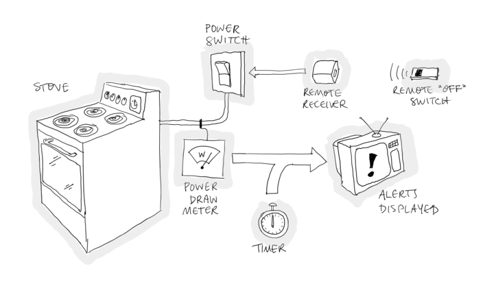

# Syndicate/js Examples

This page describes some of the example programs that are part of the
JavaScript implementation of Syndicate.

## Clickable Button

This is a simple clickable button; each time the button is clicked,
the number on the face of the button is incremented.

The actor maintaining the counter also maintains the button's label
and listens to click events. It uses the Syndicate/js UI driver to
publish the button's label text based on its internal state and to
subscribe to button click events.

 - [DEMO](button/)
 - [Source code](button/index.js) using the Syndicate/js DSL

## DOM example

This example demonstrates two actors, each using the Syndicate/js UI
driver to display user interface and receive events from it. The first
actor presents a button to the user, which when clicked sends a
message to the other actor. The second actor receives messages from
the first, updates its internal state, and reflects its new internal
state in its visible UI.

 - [DEMO](dom/)
 - [Source code](dom/index.js) in plain JavaScript

## Table sorting example

A tiny model-view-controller example demonstrating display and sorting
of tabular data.

 - [DEMO](table/)
 - [Source code](table/index.js) using the Syndicate/js DSL

## Text Entry Widget

This is a simple text entry GUI control, following a design of
[Hesam Samimi](http://www.hesam.us/cs/cooplangs/textfield.pdf).

Samimi's design proceeds in two stages. In the first, it calls for two
components: one representing the *model* of a text field, including
its contents and cursor position, and one acting as the *view*,
responsible for drawing the widget and interpreting keystrokes. In the
second stage, a *search* component is added, responsible for searching
the current content of the model for a pattern and collaborating with
the view to highlight the results.

This Syndicate solution naturally has an actor for each of the three
components. The model actor maintains the current contents and cursor
position as assertions in the shared dataspace. The view actor
observes these assertions and, when they change, updates the display.
It also subscribes to keystroke events and translates them into
messages understandable to the model actor. The addition of the search
actor necessitates no changes to the model actor. The search actor
observes the assertion of the current content of the field in the same
way the view actor does. If it finds a matching substring, it asserts
this fact. The view actor must observe these assertions and highlight
any corresponding portion of text.

There are two implementations, one using Syndicate events and actions
directly, and one using the high-level Syndicate DSL.

 - High-level DSL implementation
    - [DEMO](textfield-dsl/)
    - [Source code](textfield-dsl/index.js) using the Syndicate/js DSL
 - Low-level implementation
    - [DEMO](textfield/)
    - [Source code](textfield/index.js) in plain JavaScript

## IoT Demo

This is a model of a home automation system.

The idea is to alert a homeowner to the possibility they have left the
stove switched on beyond the time they intended to.

Components in the model include:

 - a switch for the stove;
 - an electric power meter, which monitors the power drawn by the
   stove;
 - a TV, which displays alerts to the user; and
 - a remote control for the system, which can be used to switch off
   the stove remotely.

When the stove is switched on, a timer is started, and if a certain
time goes by without the stove being switched off, an alert is shown
on the TV.

The example was inspired by a talk given in May 2016 at the
[PL Seminar at Northeastern University's College of Computer Science](http://prl.ccs.neu.edu/seminars.html)
by
[Charles Consel](http://phoenix.inria.fr/index.php/members/54-charles-consel)
about the
[DiaSuite](http://phoenix.inria.fr/research-projects/diasuite) system
that he and his collaborators have been developing.

 - [DEMO](iot/)
 - [Source code](iot/index.js) using the Syndicate/js DSL

## TodoMVC

An implementation of a
[standard challenge problem](http://todomvc.com/) for web programming:
a to-do list, backed by `localStorage`, with various nice UI features.
The
[specification](https://github.com/tastejs/todomvc/blob/master/app-spec.md)
details all of the features needed for a program to qualify as a
TodoMVC implementation.

 - [TodoMVC demo](todo/)
 - [Source code](todo/index.js) using the Syndicate/js DSL
